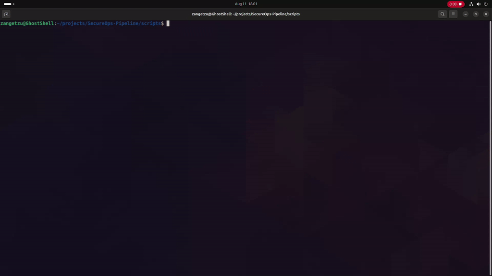
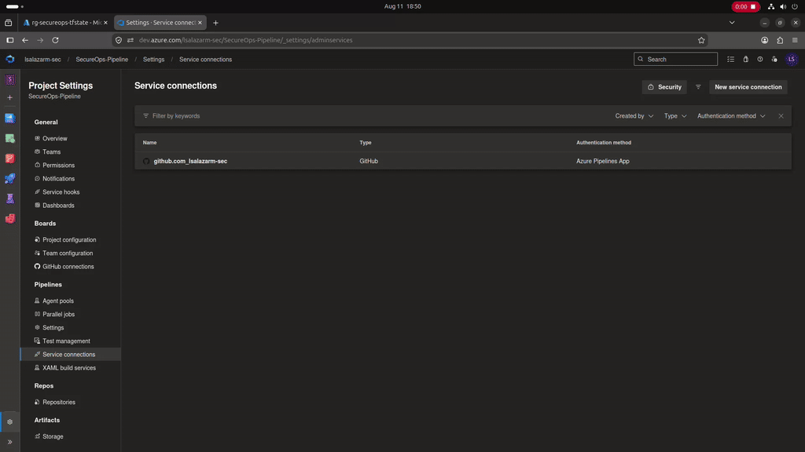
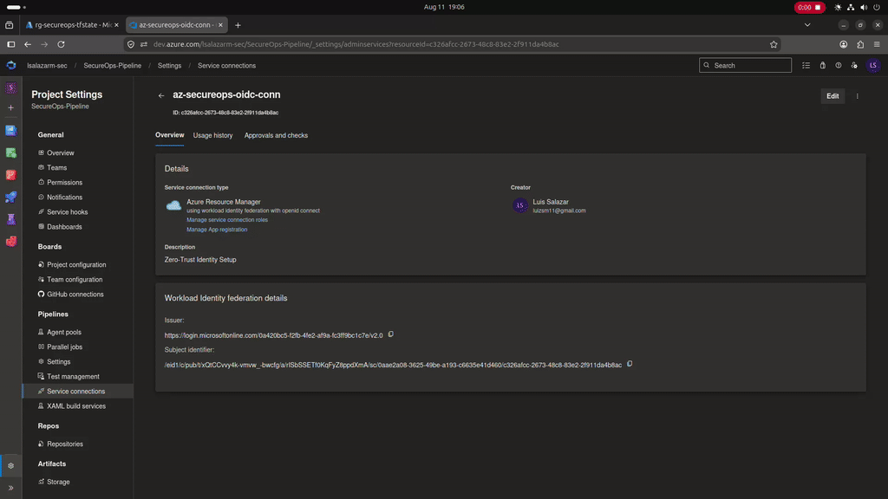
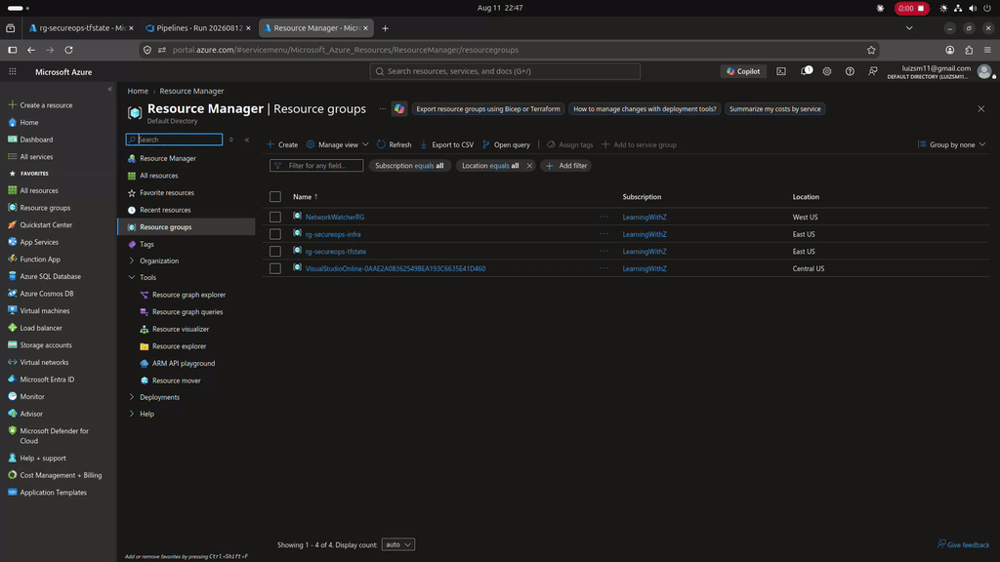

<div align="center">

# 🛡️ SecureOps Pipeline: Zero-Trust DevSecOps Infrastructure

**Declarative infrastructure, Shift-Left security, and automated lightweight Kubernetes deployment on Microsoft Azure.**


[Architecture](#-architecture--design-patterns) · [Lifecycle & GIFs](#-the-devsecops-lifecycle-in-action) · [Post-Mortem](#-engineering-post-mortem) · [Quickstart](#-quickstart)

</div>

---

## 📌 Overview

The **SecureOps Pipeline** is an enterprise-grade DevSecOps deployment engine that automates critical layers of modern infrastructure on Azure. It enforces strict DevSecOps principles, **Shift-Left Security**, and **Zero-Trust Identity** by eliminating static credentials through Microsoft Entra ID Workload Identity Federation (OIDC).

| Layer | Tool | Responsibility |
|-------|------|----------------|
| **CI/CD & Security** | Azure DevOps & Checkov | SAST scanning, OIDC auth, and pipeline orchestration |
| **Infrastructure** | Terraform | Declarative provisioning of Azure resources (VNet, VM, NSG) |
| **Configuration** | Ansible | OS hardening and runtime orchestration (agentless) |
| **Orchestration** | K3s | Lightweight Kubernetes with secure context isolation |

> **Philosophy:** *Infrastructure as Code* with a clean separation of state between cloud provisioning and OS configuration, applying the **Principle of Least Privilege** at every layer.

---

## 🏗️ Architecture & Design Patterns

The architecture follows a **decoupled layered model** where infrastructure state never mixes with software configuration.


### 1. Zero-Trust Security Model
* **Identity (OIDC):** Azure authentication via OpenID Connect. No long-lived client secrets are stored in code or DevOps variables.
* **Network:** NSG restricts ingress to essential ports (SSH/22, K8s API/6443) from the administrative IP only.
* **Access:** The `devsecops` (non-root) user can audit the cluster without root privileges. Ephemeral SSH keys are dynamically generated and destroyed alongside the runner agent.

### 2. State Management: "The Brain vs. The Muscle"
To ensure safe ephemeral operations, the infrastructure design strictly separates state from compute resources:
* **The Brain (`tfstate` Group):** A persistent Azure Storage Account that securely holds the `terraform.tfstate` file, provisioned via a local bootstrap script.
* **The Muscle (`infra` Group):** The actual compute resources (VNet, NSG, Linux VM). This is ephemeral and can be deployed or destroyed repeatedly by the CI/CD pipeline without losing the environment's memory.

---

## 📂 Repository Structure

```text
SecureOps-Pipeline/
├── azure-pipelines.yml   # CI/CD Pipeline definition with Checkov SAST and Terraform
├── infra/
│   ├── main.tf           # Core Azure resources (VM, VNet, NSG)
│   └── providers.tf      # Azure OIDC configuration + provider constraints
├── ansible/
│   ├── inventory.ini     # Host mapping and SSH authentication
│   ├── playbook.yml      # OS-level baseline hardening
│   └── k8s_setup.yml     # K3s installation and secure configuration
├── scripts/
│   ├── bootstrap.sh      # Provisions the zero-cost backend (The Brain)
│   └── teardown.sh       # Local FinOps script for deep-cleaning infrastructure
├── docs/Gifs/            # Pipeline execution visual evidence
└── README.md
```

---

## 🎥 The DevSecOps Lifecycle (In Action)

### Phase 1: Environment Setup & Zero-Trust
1. **Bootstrapping the Backend:** A local bash script provisions a zero-cost Azure Storage Account (`tfstate`).
   <br>
2. **OIDC Federation Setup:** Configuring Workload Identity Federation in Azure DevOps.
   <br>
3. **Pipeline Variables:** Injecting the dynamic Storage Account name into Azure DevOps.
   <br>

### Phase 2: Shift-Left & Deployment
1. **OIDC Execution:** The agent requests a short-lived token and authenticates securely.
   <br>
2. **Shift-Left Security Gate (Blocked):** Checkov SAST intercepts insecure code (e.g., exposed public IP) and halts execution.
   <br>
3. **Risk Acceptance (Passed):** After mitigating vulnerabilities and adding `checkov:skip` compensatory controls, the gate passes.
   <br>
4. **Ephemeral Deployment:** Infrastructure is provisioned automatically with dynamic SSH keys.
   <br>

### Phase 3: Cloud Verification
A view of the Azure Portal demonstrating the architectural decoupling of the persistent state (`tfstate`) and ephemeral compute (`infra`).
<br>

---

## 🧠 Engineering Post-Mortem

Documentation of critical issues resolved during development, reflecting a mature SRE and FinOps mindset.

### 1. Orphaned Infrastructure & State Corruption (FinOps)
| Field | Detail |
|-------|--------|
| **Symptom** | A local `teardown.sh` script failed mid-execution due to a missing dynamic SSH key (`ephemeral_ssh_key.pub`), ignored the error, and deleted the Azure Storage Account. |
| **Impact** | State was lost, leaving compute resources orphaned and generating unnecessary cloud costs. |
| **Resolution** | Enforced fail-fast architecture (`set -e`) in bash scripts and implemented a dummy file workaround (`touch ephemeral_ssh_key.pub`) to satisfy Terraform's local plan requirements safely. |

### 2. RBAC & Identity Authorization (Azure)
| Field | Detail |
|-------|--------|
| **Symptom** | Pipeline authenticated via OIDC but failed during `terraform apply` with an `AuthorizationFailed` error. |
| **Diagnosis** | The Microsoft Entra ID Service Principal lacked necessary Role-Based Access Control (RBAC). |
| **Resolution** | Explicitly assigned the **Contributor** role to the pipeline's Service Principal via Azure IAM. |

### 3. Azure Provider Registration Hang
| Field | Detail |
|-------|--------|
| **Symptom** | `terraform plan` hangs indefinitely at `Read complete after 0s`. |
| **Diagnosis** | Azure subscription restrictions blocked auto-registration of non-essential Resource Providers. |
| **Resolution** | Added `skip_provider_registration = true` to the `azurerm` provider block. Identified via debug: `TF_LOG=INFO terraform plan`. |

### 4. K3s Non-Root Access Isolation
| Field | Detail |
|-------|--------|
| **Symptom** | The `devsecops` user cannot run `kubectl` (permission denied). |
| **Diagnosis** | K3s creates `kubeconfig` with `0600` permissions (root-only) by default. |
| **Resolution** | Injected `INSTALL_K3S_EXEC="server --write-kubeconfig-mode 644"` during installation in Ansible. Enables non-root cluster auditing while maintaining secure defaults. |

### 5. Ansible Inventory Context Failure
| Field | Detail |
|-------|--------|
| **Symptom** | `[WARNING]: No inventory was parsed, only implicit localhost is available`. |
| **Diagnosis** | The `ansible-playbook` command did not reference `inventory.ini`, causing tasks to run on `localhost`. |
| **Resolution** | Standardized execution to always require explicit inventory: `ansible-playbook -i inventory.ini <playbook>`. |

---

## 🛠️ Quickstart

### Prerequisites
- [Terraform](https://developer.hashicorp.com/terraform/downloads) ≥ 1.5 & [Ansible](https://docs.ansible.com/ansible/latest/installation_guide/index.html) ≥ 2.14
- Azure CLI authenticated (`az login`)
- Azure DevOps project with OIDC Service Connection configured

### Phase 1: Bootstrap the Backend (FinOps)
Run the setup script locally to create the zero-cost storage account for the Terraform state.
```bash
chmod +x scripts/bootstrap.sh
./scripts/bootstrap.sh
```
*> Note: Add the output `STORAGE_ACCOUNT_NAME` to your Azure DevOps Pipeline Variables.*

### Phase 2: Run the CI/CD Pipeline
Push the code to the `main` branch. Azure DevOps will:
1. Authenticate via OIDC.
2. Run Checkov SAST scans.
3. Provision the Azure Infrastructure (VM, VNet, NSG).
*(Extract the output public IP from the Azure Portal or Pipeline logs for Ansible).*

### Phase 3: Configuration Management (Ansible + K3s)
```bash
cd ansible/

# Update inventory.ini with the new VM IP
sed -i "s/<VM_IP>/YOUR_VM_IP/g" inventory.ini

# 3.1 OS Baseline: Hardening + essential packages
ansible-playbook -i inventory.ini playbook.yml

# 3.2 Kubernetes: Install and configure K3s
ansible-playbook -i inventory.ini k8s_setup.yml
```

### Phase 4: Teardown (FinOps Clean-up)
When finished, run the automated teardown script to cleanly destroy all resources and prevent billing.
```bash
chmod +x scripts/teardown.sh
./scripts/teardown.sh
```

---

## 🗺️ Roadmap

| Version | Status | Scope |
|---------|--------|-------|
| **v0.1** | ✅ Completed | Terraform + Ansible + K3s (Foundation) |
| **v0.2** | ✅ Completed | Azure DevOps CI/CD Pipeline + OIDC + SAST (Checkov) |
| **v0.3** | 🔄 In Progress | Observability (Prometheus + Grafana + Loki) |
| **v0.4** | 📋 Planned | Policy-as-Code (OPA/Gatekeeper) + Secret Management (Vault) |

---

## 🤝 Contributing
Contributions are welcome. Please open an **Issue** to report bugs or a **Pull Request** with improvements. Follow [Conventional Commits](https://www.conventionalcommits.org/) style.

---

## 📄 License
MIT © 2026 Luis Salazar

<div align="center">

**[⬆ Back to Top](#-secureops-pipeline-zero-trust-devsecops-infrastructure)**

</div>
